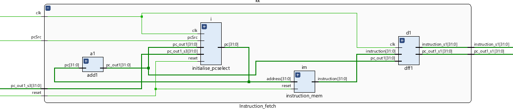
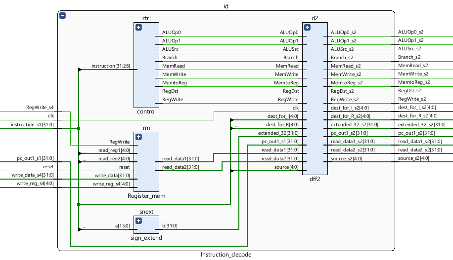
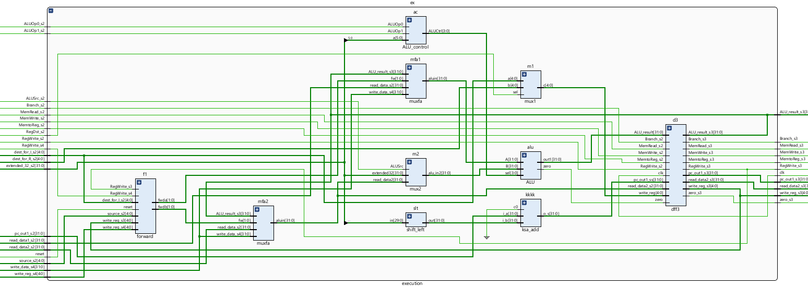
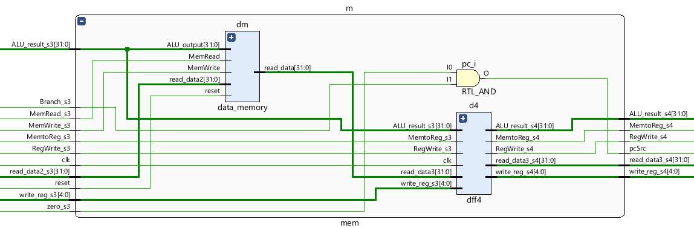
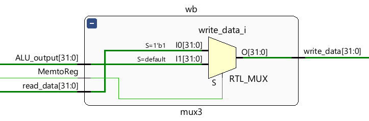
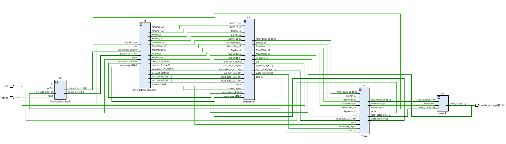

# risc_cpu
5 stage pipelined risc cpu

## Introduction
A 32-bit RISC CPU design provides higher performance capable of executing the arithmetic and logical instructions based on the strategy of reduced instructions set computer.

## Stages in Pipeline

- [Instruction fetch](https://github.com/Sairamakula1999/risc_cpu/blob/main/README.md#instruction-fetch)
- [Instruction decode](https://github.com/Sairamakula1999/risc_cpu/blob/main/README.md#instruction-decode)
- [Execution](https://github.com/Sairamakula1999/risc_cpu/blob/main/README.md#execution)
- [Memory Access](https://github.com/Sairamakula1999/risc_cpu/blob/main/README.md#Memory-access)
- [Register write](https://github.com/Sairamakula1999/risc_cpu/blob/main/README.md#Register-write)

## Instruction fetch
Here instruction is fetched i.e. by using program counter has it contains address of next instruction, use it and fetch instruction from instruction memory. For initial case global reset is given to all stages. So, default state is loaded with help of these.

## Instruction decode
Here instruction is decoded i.e instruction obtained from instruction memory is used to get address of registers to be used and obtain data values of them from register bank using that address. Also identify what operation has to be performed and generate control signals accordingly. Extend the secondary register value to 32 bit so that if intermediate values are needed in required operation or function it is ready to use in next stage. 

## Execution
Here based on function decoded in previous stage control signals are used and required operation is performed. Here ALU consists of koggestone adder/subtractor, booth multiplier. If any branching condition happens then it is branched accordingly. So, next two operations are should be choosen in a way(by compiler or us) that looping wont affect the values of the performed operations even after execution. for warding unit is also present here to avoid data hazards but load use hazard is still needs to be added by adding stall feature in existing design.

## Memory access
Here based on operation either memory stored or loaded or simply skipped.

## Register write
Here values are written back to the register bank.

## Entire layout

## Timing report

## Power report

## References

